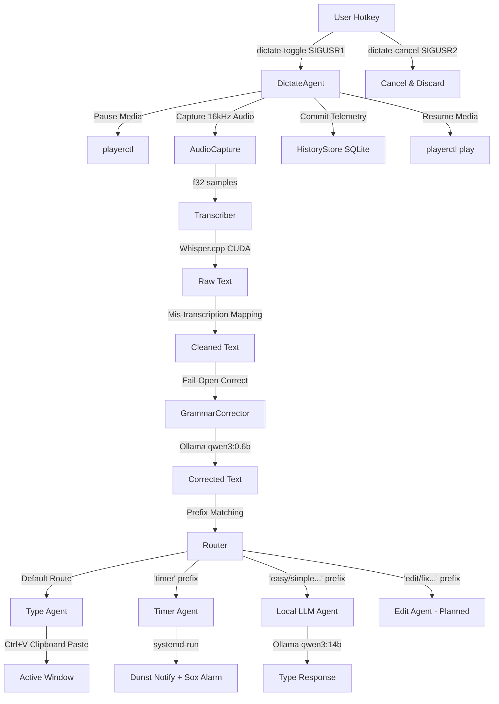

# Dictate Agent: Local Voice Assistant & Intelligent Dictation Daemon

The **Dictate Agent** is a lightweight, local-first voice dictation and task execution system designed for Arch Linux. Leveraging the power of a dedicated Nvidia RTX 5080, it runs GPU-accelerated Whisper model inference for speech-to-text and a local Ollama server for inline grammar correction and LLM task execution.

The daemon acts as an orchestrator, receiving signals from the window manager to toggle audio recording, processing the captured audio through an AI pipeline, and outputting the result either directly as keystrokes (typing into the active window) or executing local system commands.

---

## System Architecture

The following diagram illustrates the lifecycle of a single dictation toggle. When the user hits the hotkey, audio is captured, processed, routed, and dispatched:

---

## Core Agents & Pipeline Components

### 1. The Orchestrator Daemon: [DictateAgent](file:///home/jakedevar/dictate_agent/crates/dictate-core/src/agent.rs#L18)
The daemon binds to POSIX signals to handle recording toggles and cancellations asynchronously:
* **`SIGUSR1` (Toggle)**: Handled by [dictate-toggle](file:///home/jakedevar/dictate_agent/scripts/dictate-toggle). Starts audio capture, pauses media if playing (via `playerctl`), and launches the processing pipeline on a subsequent toggle.
* **`SIGUSR2` (Cancel)**: Handled by [dictate-cancel](file:///home/jakedevar/dictate_agent/scripts/dictate-cancel). Immediately stops the input stream, purges buffers, discards captured audio, and resumes system media.

> [!NOTE]
> Media states are tracked via a temporary state file (`~/.config/dictate-agent/media_state`). This ensures that if the daemon is interrupted or crashes, it cleans up stale states without leaving media players paused permanently.

### 2. Audio Capture Engine: [AudioCapture](file:///home/jakedevar/dictate_agent/crates/dictate-audio/src/lib.rs#L7)
Captures raw audio streams using `cpal` from the default ALSA/PipeWire input.
* Requests **16kHz mono** audio format.
* Prefers `f32` sample buffers, falling back to `i16` with float conversion if required by hardware.
* Implements a **500ms trailing delay** upon stopping to ensure final words are not clipped during transcribing.

### 3. Speech-to-Text Pipeline: [Transcriber](file:///home/jakedevar/dictate_agent/crates/dictate-stt/src/transcribe.rs#L21)
Runs local Whisper inference using GGUF model configurations.
* **Hardware Acceleration**: Configured for CUDA execution, running Whisper parameters on the Nvidia RTX 5080.
* **Model**: Typically uses `ggml-large-v3-turbo.bin` (see [config.example.toml](file:///home/jakedevar/dictate_agent/config/config.example.toml#L8)).
* **Hardcoded Corrections**: Translates common acoustic mishearings (e.g., "clod/cloud" to "Claude") and verbal commands (e.g., "create plan" to `/create_plan` slash commands).

### 4. Grammar Correction Agent: [GrammarCorrector](file:///home/jakedevar/dictate_agent/crates/dictate-fmt/src/grammar.rs#L23)
An optional, inline agent that runs prior to router analysis.
* Sends raw text to Ollama running a fast model (e.g., `qwen3:0.6b`).
* Uses a specialized prompt instructing the LLM to only fix punctuation, spelling, and grammar without rephrasing or altering the core semantic meaning.
* **Fail-Open Strategy**: If Ollama is not running, times out, or returns a response outside validation length parameters (0.5x to 1.5x of original length), the corrector rejects the changes and yields the raw Whisper text.

### 5. Routing & Dispatch: [router](file:///home/jakedevar/dictate_agent/crates/dictate-core/src/router.rs#L2)
Inspects the transcribed and corrected text to decide how to respond. The system matches prefixes and dispatches to the corresponding execution agents:

| Trigger Prefix | Route Type | Destination Agent | Description |
|---|---|---|---|
| None (Default) | `Type` | [OutputHandler](file:///home/jakedevar/dictate_agent/crates/dictate-inject/src/output.rs#L6) | Paste text directly into the focused window. |
| `timer` | `Timer` | [TimerExecutor](file:///home/jakedevar/dictate_agent/crates/dictate-core/src/timer.rs#L289) | Schedules a systemd user timer. |
| `easy`, `simple`, `medium`, `hard` | `Local` | [LocalExecutor](file:///home/jakedevar/dictate_agent/crates/dictate-core/src/local_executor.rs#L14) | Executes prompt with local Ollama LLM and types result. |
| `edit:`, `fix:`, `change:`, `rewrite:` | `Edit` | *Planned* | Structural text transformations. |

---

## Action Execution Agents

### Output Agent: [OutputHandler](file:///home/jakedevar/dictate_agent/crates/dictate-inject/src/output.rs#L6)
Responsible for typing generated or transcribed text. Rather than typing key-by-key (which is slow and error-prone), the Output Agent uses a clipboard-paste approach:
1. Temporarily copies and backs up the user's active clipboard contents.
2. Writes the target text to the system clipboard.
3. Uses `enigo` to simulate a `Ctrl+V` key combination to paste instantly.
4. Waits `50ms` for the OS to register the paste action.
5. Restores the user's original clipboard contents.

### Local LLM Agent: [LocalExecutor](file:///home/jakedevar/dictate_agent/crates/dictate-core/src/local_executor.rs#L14)
Provides local AI generation on-demand.
* Triggered when a phrase begins with a difficulty level (e.g., "easy explain quantum computing").
* Dispatches the query directly to Ollama running a larger model (e.g., `qwen3:14b` on the RTX 5080).
* Feeds the text response back to the Output Handler to automatically paste the model's answer.
* If Ollama is not active, it will automatically attempt to spawn it (`ollama serve`) and poll for up to 10 seconds.

### Timer Agent: [TimerExecutor](file:///home/jakedevar/dictate_agent/crates/dictate-core/src/timer.rs#L289)
Manages localized natural language timers.
* Parsed durations support both digit strings and words (e.g. "two hours and a half", "15 minutes", "half an hour").
* Schedules a transient user systemd service using `systemd-run --user --on-active=<duration>`.
* Once the timer fires, it runs a shell script that plays an alarm sound (using `play` from sox) and triggers a critical desktop notification (via `dunstify`) that stays open until dismissed.

---

## History & Telemetry Store: [HistoryStore](file:///home/jakedevar/dictate_agent/crates/dictate-history/src/history.rs#L11)
Telemetry is written to a local SQLite database (`~/.local/share/dictate-agent/history.db`).
Every voice interaction creates a structured record mapping:
* **Durations**: Audio capture duration, transcription latency, grammar correction latency, and LLM processing duration.
* **Changes**: Grammar corrections applied, input/output diff, and routing classification details.
* **Status**: Execution success indicators, error summaries, and outputs typed.

> [!TIP]
> The database runs with Write-Ahead Logging (`PRAGMA journal_mode=WAL`) enabled, allowing concurrent reads/writes without locking the main thread during high-frequency speech sessions.
